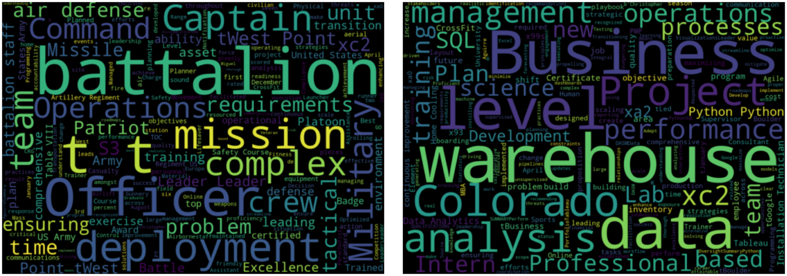

### Mission-driven to maximize decision intelligence.

#### Army Career &#10230;&#10230;&#10230;&#10230;&#10230;&#10230;&#10230;&#10230;&#10230;&#10230;&#10230;&#10230; More Recently

<table>
  <tr>
    <!-- First Code Dropdown -->
    <td>
      

        
Wordcloud code

        <pre><code>
&#35; Import necessary libraries/modules      
import textract
from nltk.corpus import stopwords
from nltk.tokenize import word_tokenize, sent_tokenize
import re
from wordcloud import WordCloud
          
&#35; Extract text from the document
text = textract.process('/Users/chris/Desktop/Army.docx')

&#35; Filter out character codewords
cleaned_text = re.sub(r'\\(n|xe2|x80|x99)', '', str(text))

&#35; Tokenize the words in the text
tokens = word_tokenize(cleaned_text)

&#35; Tokenizing the sentences in the text
sentences = sent_tokenize(cleaned_text)

&#35; Remove stopwords and create 'filtered_tokens' variable
stop_words = set(stopwords.words('english'))
filtered_tokens = [word for word in tokens if word not in stop_words]

&#35; Create wordcloud with filtered tokens
wordcloud = WordCloud(width=1400, height=1000).generate(' '.join(filtered_tokens))
plt.imshow(wordcloud, interpolation='bilinear')
plt.axis('off')
plt.show()

for i in range(10):
    print(i)
        </code></pre>
      

    </td>
    
    <!-- Second Code Dropdown -->
  <td>
      

        
Tree Map/Confusion Matrix code

        <pre style="white-space: pre-wrap;"><code>
&#35; Import necessary libraries/modules 
import numpy as np
import pandas as pd
import matplotlib.pyplot as plt
import seaborn as sns
import squarify

# Add a blank line for spacing
&#35; Plot hobbies treemap
categories = ['Piano', 'Hiking in the Mountains', 'Snowboarding', 'Tennis','CrossFit',
              'AI Generated Art','Learning New Skills','Going on Adventures!']
sizes = [20, 20, 10, 10, 20, 5, 15, 15] 
colors = ['red', 'green', 'blue', 'grey']

plt.figure(figsize=(12, 8))
squarify.plot(sizes=sizes, label=categories, color=colors, alpha=0.7, pad=0.01)

plt.title('Some of my Hobbies',fontweight='bold',fontsize=20)
plt.axis('off')  # Disable the axis

&#35; Adjust label formatting
for i, label in enumerate(plt.gca().texts):
    label.set_fontsize(13.5)  
    label.set_weight('bold')

plt.show()

&#35; Create list of predictions and transform into 2x2 numpy array
predictions_list = [0,0,0,1]
predictions_matrix = np.array(predictions_list).reshape(2,2)
    
&#35; Plot confusion matrix using seaborn heatmap
plt.figure(figsize=(5,4))
ax = sns.heatmap(predictions_matrix, vmin=0, vmax=1, annot=True, 
                    cmap = sns.color_palette("mako", as_cmap=True), fmt='g')
plt.title('Confusion Matrix', fontsize=16, fontweight='bold')
plt.xlabel('Predicted Label')
plt.ylabel('True Label')
    
plt.show()
for i in range(10):
    print(i)
        </code></pre>
      

    </td>
  </tr>
</table>

<table style="border-collapse: collapse; border-spacing: 0; margin: 0; padding: 0;">
  <tr style="margin: 0; padding: 0;">
    <td style="margin: 0; padding: 0; border: none; align: left;">
      
    </td>
    <td style="vertical-align: top; margin: 0; padding: 0;">
      Welcome!   I predicted you'd be visiting today.  
      Looks like my Accuracy, Recall, Precision, and F1 scores are all at <strong>100%!</strong>
    </td>
  </tr>
</table>

<table>
  <tr>
    <td style="padding-right: 20px;"> <!-- Add padding to create space -->
      Open to collaboration on data science / data analysis projects.
    </td>
    <td>
      
    </td>
  </tr>
</table>

<!---
chrisaguirre3/chrisaguirre3 is a ✨ special ✨ repository because its `README.md` (this file) appears on your GitHub profile.
You can click the Preview link to take a look at your changes.
--->
