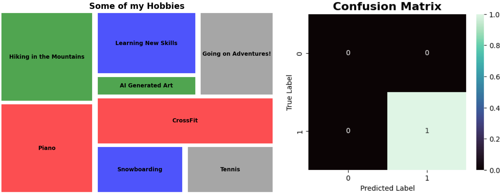

### Mission-driven to maximize decision intelligence by applying data science tools and techniques.

#### Army Career &#10230;&#10230;&#10230;&#10230;&#10230;&#10230;&#10230;&#10230;&#10230; More Recently

Open to collaboration on data science / data analysis projects.
- 📫 Contact: 

<!---
chrisaguirre3/chrisaguirre3 is a ✨ special ✨ repository because its `README.md` (this file) appears on your GitHub profile.
You can click the Preview link to take a look at your changes.
--->
