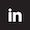

### Mission-driven to maximize decision intelligence.

#### Army Career &#10230;&#10230;&#10230;&#10230;&#10230;&#10230;&#10230;&#10230;&#10230;&#10230;&#10230;&#10230; More Recently

  
Wordcloud code
  
  <pre style="white-space: pre-wrap;"><code>
&#35; Import necessary libraries/modules      
import textract
from nltk.corpus import stopwords
from nltk.tokenize import word_tokenize, sent_tokenize
import re
from wordcloud import WordCloud  

&#35; Extract text from the document
text = textract.process('/Users/chris/Desktop/Army.docx')

&#35; Filter out character codewords
cleaned_text = re.sub(r'\\(n|xe2|x80|x99)', '', str(text))

&#35; Tokenize the words in the text
tokens = word_tokenize(cleaned_text)

&#35; Tokenizing the sentences in the text
sentences = sent_tokenize(cleaned_text)

&#35; Remove stopwords and create 'filtered_tokens' variable
stop_words = set(stopwords.words('english'))
filtered_tokens = [word for word in tokens if word not in stop_words]

&#35; Create wordcloud with filtered tokens
wordcloud = WordCloud(width=1400, height=1000).generate(' '.join(filtered_tokens))
plt.imshow(wordcloud, interpolation='bilinear')
plt.axis('off')
plt.show()
for i in range(10):
    print(i)
  </code></pre>

<table style="border-collapse: collapse; border-spacing: 0; margin: 0; padding: 0;">
  <tr style="margin: 0; padding: 0;">
    <td style="margin: 0; padding: 0; border: none; align: left;">
      
    </td>
    <td style="vertical-align: top; margin: 0; padding: 0;">
      Welcome!   I predicted you'd be visiting today.  
      Looks like my Accuracy, Recall, Precision, and F1 scores are all at <strong>100%!</strong>
    </td>
  </tr>
</table>

<table>
  <tr>
    <td style="padding-right: 20px;"> <!-- Add padding to create space -->
      Open to collaboration on data science / data analysis projects.
    </td>
    <td>
      
    </td>
  </tr>
</table>

<!---
chrisaguirre3/chrisaguirre3 is a ✨ special ✨ repository because its `README.md` (this file) appears on your GitHub profile.
You can click the Preview link to take a look at your changes.
--->
